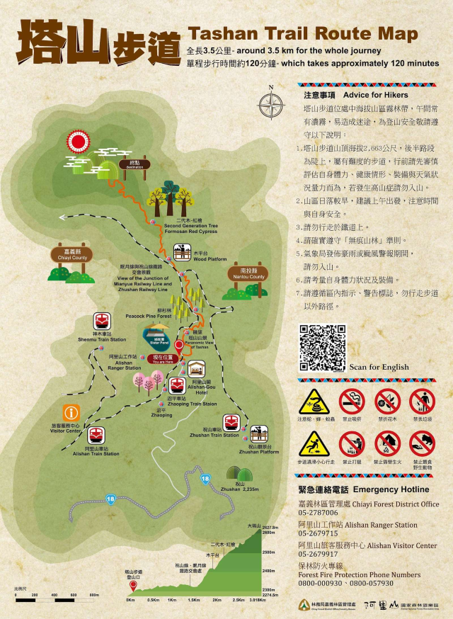

# Visual Odometry 
## Motivation
Well, this project is about creating a visual odometry system using SuperGlue for feature matching. Honestly, it all started because I just wanted to record my trip to Taiwan's Alishan Mianyue Line Railway. But then, I thought—why not take it a step further? Adding visual odometry seemed like a fun way (even it's simple) to really bring those memories to life and remind myself just how amazing that trip was.



<video src="./assets/demo.mp4" controls></video>

## Usage
### Env
```
wsl 2.0(Ubuntu)
cuda == 12.4
python == 3.10
numpy == 1.24.2
opencv-python == 4.7.0.72
torch == 2.6.0
torchvision == 0.21.0 
matplotib == 3.7.1
```
I was running in wsl, so I used matplotlib to do visualization but not open3d.

### Data preparation
#### camera calibration
Since the video was shooted by my Pixel 6 and I did not know what is the camera intrinsic, so I used a checkboard to do calibration. The chessboard image and camera intrinsic are in ./camera_data. You need to take the pics or videos of chessboard in different angles. 

- Checkout ./camera_calibration.py for how to further using.
- If you want to get frames, see ./preprocessing.py.

### Download SuperGlue
To set up SuperGlue, run the download script:

```bash
python download_superglue.py
```

This will clone the SuperGlue repository and install the necessary dependencies.

### Visual odometry
#### How It Works
1. Feature detection using SuperPoint
2. Feature matching with SuperGlue (falls back to conventional methods if SuperGlue is unavailable)
3. Essential matrix estimation and pose recovery
4. Trajectory smoothing using Kalman filtering
5. Visualization and storage of trajectory data

Run the visual odometry code with:

```bash
python vo.py <directory_of_sequential_frames>
```

For example:

```bash
python vo.py ./frames
```

### Combine video and trajectory
Simply combine multiple videos together, see ./postprocessing.py.


